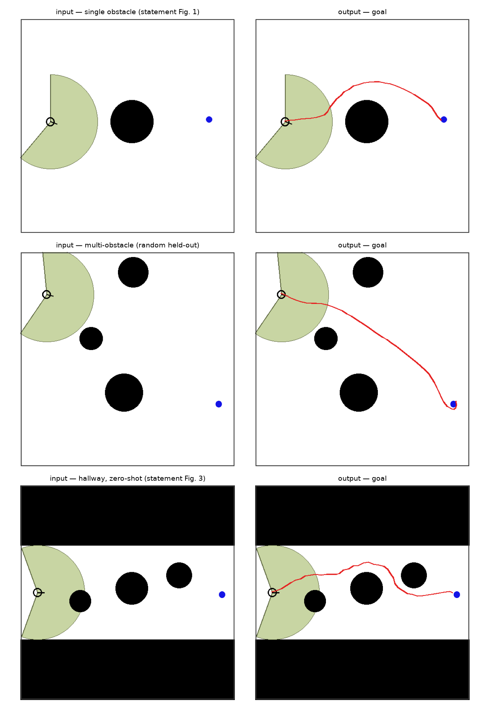
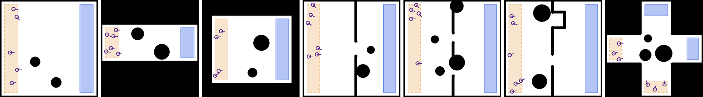

# Learning Multi-Agent Steering Policies from Scene Images with Convolutional Perception and Deep Reinforcement Learning

**Daniel Hu** · Oxford College of Emory University · Advisor: Dr. Hai Le
Undergraduate research project, Fall 2026

<p align="center">
  
  <br>
  <em>Left: input image. Right: the path the learned agent takes to the goal (red). The corridor in the bottom row was not seen during training.</em>
</p>

## Overview

Steering behavior describes how a mobile agent moves toward a goal while avoiding obstacles, walls and other agents. It is usually written by hand. The automated model discovery framework of Le and Hu [1, 2] instead searches for it with a genetic algorithm over a symbolic space of sensing, filtering and acting rules.

This project takes a third route: learn the behavior, and learn it starting from a picture. A convolutional network parses a scene image into a structured description, and a reinforcement learning policy drives every agent in that scene from a local, ego-centric observation. The output is the path each agent walks to its goal. There are no hand-labeled images and no hand-written steering rules; the renderer produces the labels, and the policy learns from reward.

Since the symbolic search and the learned policy can be run on the same scenarios with the same metrics, the project also gives a direct comparison between the two.

## Pipeline

| Stage | Component | Input → Output |
|---|---|---|
| 1 | Scene image | 512 × 512 PNG |
| 2 | U-Net pixel classifier | image → 6-class label map |
| 3 | Geometry extraction | label map → agent poses, obstacles, walls, regions |
| 4 | Scene instantiation | structured description → simulator state |
| 5 | Ego-centric observation | simulator state → 51 numbers per agent per step |
| 6 | Shared policy (PPO) | observation → (turn, speed) |
| 7 | Synchronous simulation | actions → trajectories |
| 8 | Path rendering | trajectories → paths drawn over the input |

Generality comes from the observation. Each agent sees 16 field-of-view sectors (220°, range 22 in a 100 × 100 world), reported separately for three entity categories: obstacles, walls and other agents. Goal distance, goal bearing and the agent's own speed are appended. Distances are clipped and normalized, so the vector never encodes absolute position. A corridor is just a set of near readings in some sectors, in the same format as any other layout. Sectors are split by entity category because the discovered symbolic models filter entities by type, and giving the learned policy the same distinction means both methods read the same information. All agents share one policy and step synchronously.

## Repository layout

| Path | Contents |
|---|---|
| [`sim/`](sim/) | Scene generator and multi-agent simulator: seven layout families, pixel-exact label maps, JSON ground truth, configuration-space validation, 13 unit tests. See [`sim/README.md`](sim/README.md). |
| [`pilot/`](pilot/) | Earlier end-to-end pilot (128 × 128, single agent): U-Net perception, PPO policy, evaluation and figures. See [`pilot/README.md`](pilot/README.md). |
| [`Detailed Proposal.docx`](Detailed%20Proposal.docx) | Full project proposal: approach, infrastructure, experiment plan and compute estimate. |
| [`docs/`](docs/) | Figures used in this README. |
| [`requirements.txt`](requirements.txt) | Python dependencies for `sim/` and `pilot/`. |

## Scene generator

<p align="center">
  
  <br>
  <em>The seven layout families: open, corridor, room, doorway, two-doorway, cul-de-sac, crossing. Orange: spawn regions. Blue: goal regions. Black: obstacles and walls.</em>
</p>

Each scene is written as an RGB image, a label map whose pixel values are class indices, and a JSON file with exact agent poses, obstacle geometry, wall segments and regions.

Scenes are validated in configuration space before they are written. Obstacles are inflated by the agent radius with a Euclidean distance transform, so the check "a disk of radius *R* fits here" is exact rather than approximated on a grid. The tightest passage from start to goal is measured and stored with the scene as a difficulty label. Obstacles are placed one at a time and the check is re-run after each placement, so a scene cannot end up sealed.

Throughput on a single laptop CPU core:

| Operation | Cost |
|---|---|
| Scene sample + validate + render + write | 50 ms (about 20 scenes/s) |
| Simulation step | 0.07 ms per agent-step (about 14,000 agent-steps/s) |
| Render 512 × 512 with labels | 8.1 ms |
| Disk footprint | 15.4 KB per scene |

Baseline difficulty per layout, measured with a greedy controller that turns toward the goal at full speed (20 scenes per layout, 4 agents, 3 obstacles):

| | open | room | two-doorway | doorway | corridor | cul-de-sac | crossing |
|---|---|---|---|---|---|---|---|
| Greedy success | 56% | 34% | 12% | 6% | 5% | 5% | 4% |

Cul-de-sac and crossing are the hardest cases for a locally sensing policy. From outside, a sealed pocket looks the same as a real exit, and at a crossing the agents have to avoid each other rather than static geometry.

## Preliminary results (pilot)

The pilot in [`pilot/`](pilot/) runs the full image → parse → simulate → path chain on a laptop CPU, with a single agent at 128 × 128 resolution. The policy is trained only on open scenes with 1 to 3 obstacles. Corridor layouts are held out and used for zero-shot evaluation.

Perception (U-Net trained on renderer-emitted labels, 60 validation scenes): 99.7% pixel accuracy, obstacle count recovered in 100% of scenes, mean agent-center error 0.5 world units, mean heading error 5.3°.

Policy (PPO, 100 episodes per condition) against a go-straight baseline. "Policy only" runs on ground-truth geometry; "end-to-end" runs the full image → parse → simulate chain with the best of the three seeds:

| Layout | Go-straight baseline | PPO, policy only (mean of 3 seeds) | PPO, end-to-end pipeline (best seed) |
|---|---|---|---|
| Single obstacle | 79% | 100% | 100% |
| Multi-obstacle (held-out random) | 46% | 99% | 98% |
| Corridor (zero-shot) | 22% | 75% | 66% (82% with oracle geometry) |

End-to-end evaluation: the policy acts inside the parsed scene, so perception errors propagate, and the resulting trajectory is checked against the ground-truth scene. An oracle condition (policy on ground-truth geometry) separates the cost of perception from the cost of the policy. On the zero-shot corridor, success is 66% through the full pipeline and 82% with oracle geometry, with no parse failures.

## Planned experiments

The proposal lays out five experiment families on the `sim/` suite:

- **E1, layout generality.** Train on a subset of layout families and evaluate on all seven, including families that were held out, stratified by the recorded bottleneck width.
- **E2, reward design.** Vary progress shaping, collision penalty, step cost and clearance bonus, and measure how the behavior changes. This is the learned-policy counterpart of fitness-function sensitivity in genetic search.
- **E3, multi-agent scaling.** Train and evaluate at 2, 4, 8 and 16 agents, and test whether a policy trained at one density transfers to another.
- **E4, comparison with discovered symbolic models.** Align scenarios, metrics and protocol with the existing framework's obstacle-avoidance models. Compare paths as well as aggregate numbers, and distill the learned policy into a shallow decision tree over the same observation to see how much performance the distillation costs.
- **E5, perception robustness.** Sweep resolution and augmentation strength, report detection error as a function of nearest-neighbor agent spacing, and measure the downstream cost of perception error through the pipeline-vs-oracle gap.

## Quickstart

Python 3.10 or newer.

```bash
git clone https://github.com/danielxhu/cnn-rl-multi-agent-steering.git
cd cnn-rl-multi-agent-steering
python3 -m venv .venv && source .venv/bin/activate
pip install -r requirements.txt
```

Generate scenes and run the generator's tests:

```bash
cd sim
python generate.py --n 7 --layout mixed --preview 7 --out data/preview   # one scene per layout
python generate.py --n 3000 --layout mixed --agents 3-8 --obstacles 2-6 --seed 0 --out data/train
python tests/run_tests.py                                                # 13 tests, ~20 s
```

Reproduce the pilot (about 25 minutes on a laptop CPU, no GPU needed):

```bash
cd pilot
python perception.py        # U-Net -> results/unet.pt
python train_rl.py 0 1 2    # PPO, 3 seeds -> results/ppo_seed{0,1,2}.zip
python evaluate.py          # policy vs. baseline -> results/policy_metrics.json
python end_to_end.py        # image -> path figures and pipeline-vs-oracle metrics
```

## References

1. H. Le and X. Hu. Extended Model Space Specification for Mobile Agent-Based Systems to Support Automated Discovery of Simulation Models. In *Proceedings of the 2020 Winter Simulation Conference (WSC)*, 2020.
2. H. Le and X. Hu. Automated Model Discovery for Steering Behavior Simulation. In *Proceedings of the 2022 Annual Modeling and Simulation Conference (ANNSIM)*, San Diego, CA, 2022.

## License

Copyright © 2026 Daniel Hu. All rights reserved. The code is published for reference and reproducibility. If you would like to use it, please open an issue.
